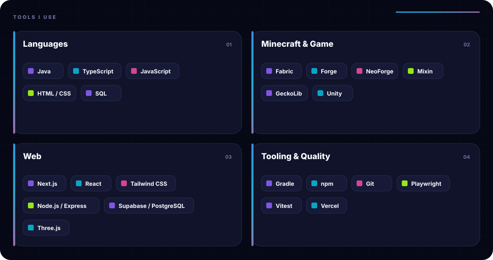
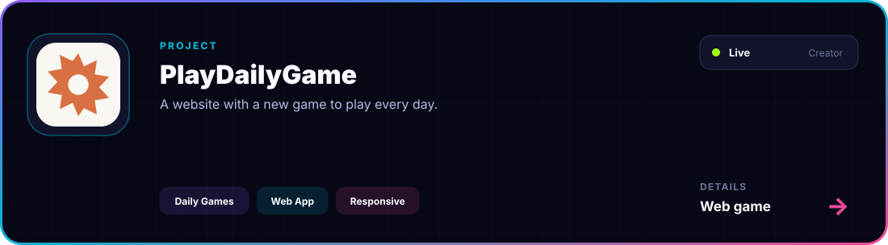
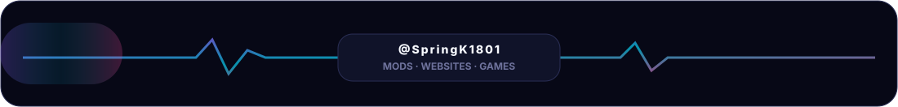

<!--
THIS FILE IS AUTOMATICALLY GENERATED.
Edit profile.config.json, then run: npm run build
See CUSTOMIZATION.md for the complete guide.
-->

  <picture>
    <source media="(prefers-color-scheme: dark)" srcset="./assets/generated/header-dark.svg">
    <source media="(prefers-color-scheme: light)" srcset="./assets/generated/header-light.svg">
    
  </picture>

## 01 / About

I like projects with moving parts: Minecraft mechanics, modular game systems, full-stack products and interfaces that feel good to use.

My favorite part is taking an idea from the rough experimental stage all the way to something real, interactive and shippable.

<table>
<tr>
<td width="33%" valign="top">
GAME SYSTEMS 
<strong>Mechanics with depth</strong>  
Designing progression, combat, animation and interconnected Minecraft systems.
</td>
<td width="33%" valign="top">
FULL-STACK WEB 
<strong>Products, not just pages</strong>  
Building responsive interfaces, server logic, data models, auth and secure admin tools.
</td>
<td width="33%" valign="top">
CREATIVE BUILDING 
<strong>Ideas into experiences</strong>  
Mixing code, interaction and visual polish to make ambitious concepts feel tangible.
</td>
</tr>
</table>

## 02 / Tech stack

<picture>
  <source media="(prefers-color-scheme: dark)" srcset="./assets/generated/stack-dark.svg">
  <source media="(prefers-color-scheme: light)" srcset="./assets/generated/stack-light.svg">
  
</picture>

Only tools supported by repository evidence are shown. The list is explicitly editable in <a href="./profile.config.json">profile.config.json</a>.

## 03 / Featured project

<a href="https://github.com/Caravel-Racing/CaravelRacing-f1">
  <picture>
    <source media="(prefers-color-scheme: dark)" srcset="./assets/generated/project-1-dark.svg">
    <source media="(prefers-color-scheme: light)" srcset="./assets/generated/project-1-light.svg">
    
  </picture>
</a>

**[Repository →](https://github.com/Caravel-Racing/CaravelRacing-f1)** · **[Live site ↗](https://caravelracing.com/)**

## 04 / What I'm building toward

- Modular Minecraft systems with stronger architecture, animation and gameplay depth.
- Full-stack web products that connect polished interfaces to real data and secure workflows.
- Interactive 3D and game-like experiences that make the web feel less static.

> The through-line: make the system interesting, make the interface clear, then keep refining both.

## 05 / Contribution trail

  <picture>
    <source media="(prefers-color-scheme: dark)" srcset="https://raw.githubusercontent.com/SpringK1801/SpringK1801/output/github-contribution-grid-snake-dark.svg">
    <source media="(prefers-color-scheme: light)" srcset="https://raw.githubusercontent.com/SpringK1801/SpringK1801/output/github-contribution-grid-snake.svg">
    
  </picture>

Generated daily from public contribution data by a least-privilege GitHub Actions workflow.

## 06 / Connect

**[@SpringK1801](https://github.com/SpringK1801)**

Always building. Usually iterating.

  <picture>
    <source media="(prefers-color-scheme: dark)" srcset="./assets/generated/footer-dark.svg">
    <source media="(prefers-color-scheme: light)" srcset="./assets/generated/footer-light.svg">
    
  </picture>

